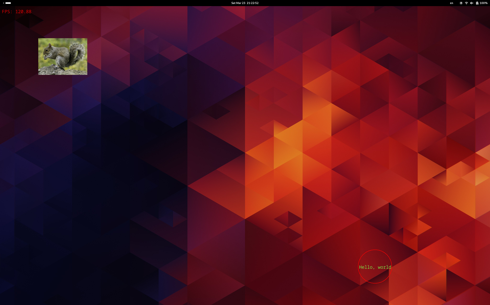

# overlaylib

A Rust crate for drawing immediate-mode overlays. Supports basic shapes (rectangles, triangles, lines, cirles), text, and textures.
The overlay doesn't register clicks, allowing applications below it to still be interacted with. Rendering over fullscreen apps is not supported (PRs/suggestions welcome). This library does not include any way to provide input or otherwise interact with the UI, that is not its intended use case, if you need input, then use egui (Rust native) or the Rust ImGui bindings.

Tested on KDE Plasma 5 and GNOME Desktop, both X11. It *may* work on Wayland at it even *might* work on Windows, but those weren't tested as I use X11 and don't use Windows. Let me know if they work for you or if you needed to change something.

An example of how to use it can be found at https://github.com/EquinoxAlpha/overlaylib-example.

## why

I knew that ImGui would be a good choice for overlays of all kinds, however, I found it too bloated for my use case and set out to make
a library which won't be as large and would hopefully be as simple to use. ImGui wasn't really intended for overlays of this kind, however
many people (including myself) do use it like that, and obviously this library doesn't have a full GUI and layout engine as ImGui does.

## drawbacks

The code can definitely be cleaner, and some parts of it need to be a little more thought out.
Another problem comes from immediate-mode rendering, because currently, the vertex buffers are
reconstructed every frame which is quite expensive.

I haven't put much work into optimization, so overlaylib might be slow with many elements on screen. No benchmarks have been performed.

The font rendering looks a little weird. I don't know how to fix it. Mileage may vary, however you can mitigate this by drawing text at a font height that the font was uploaded with (in other words, don't upscale too much and don't downscale too much; the height of the default font is 24px)

## screenshot

(note: the squirrel is part of the overlay, showcasing texture support)